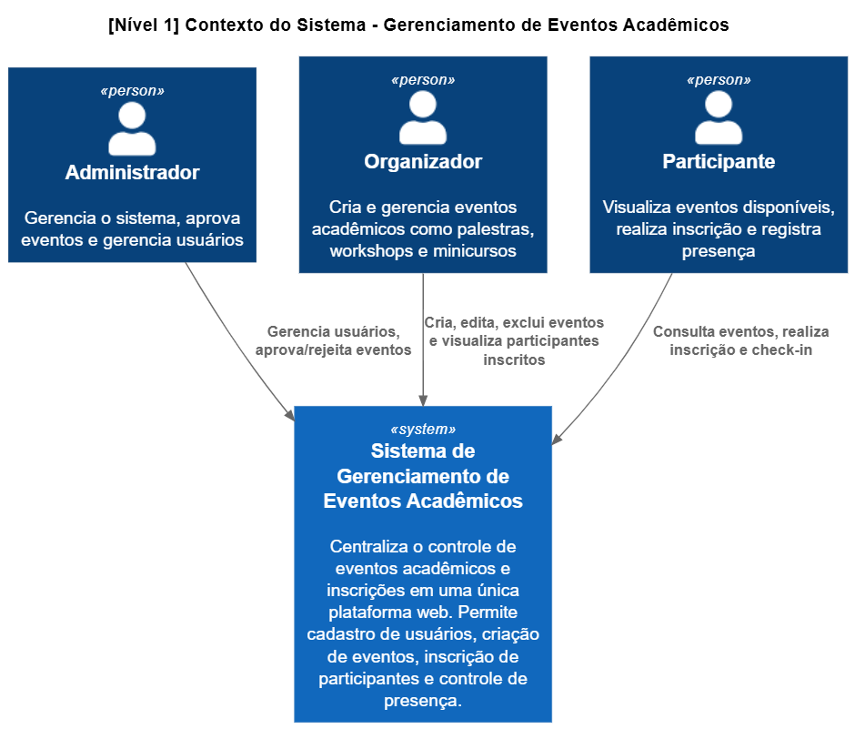
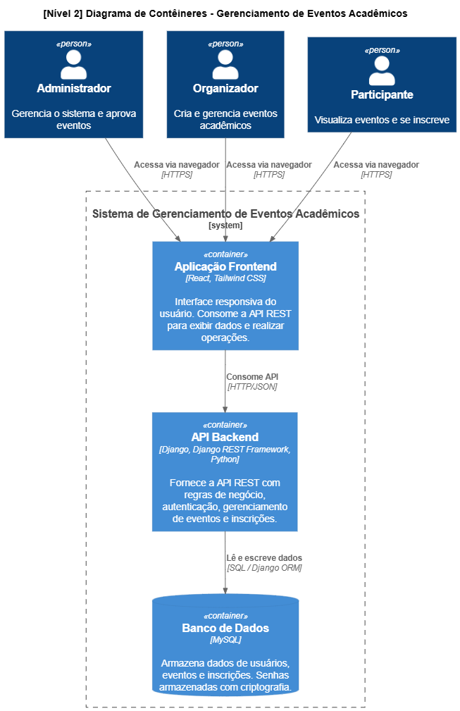
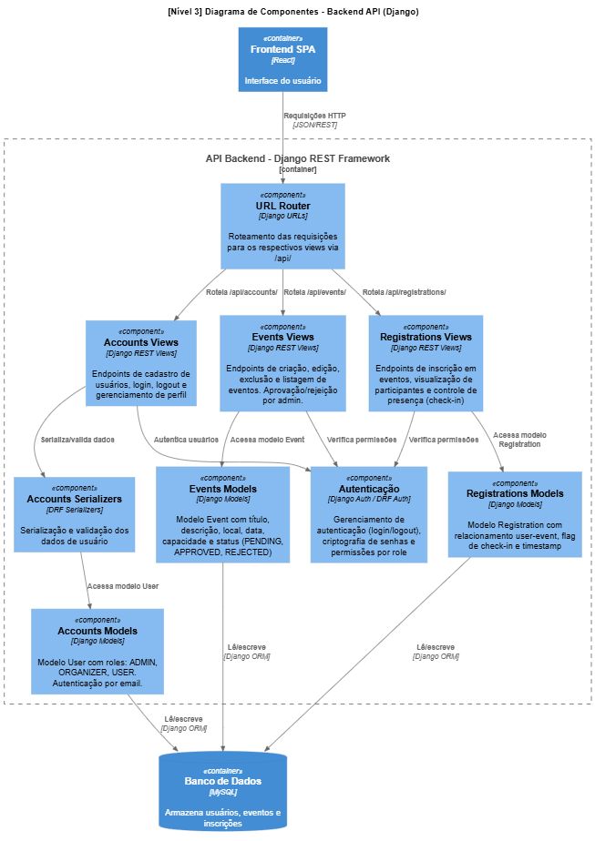
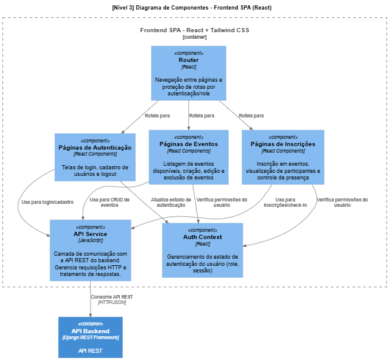
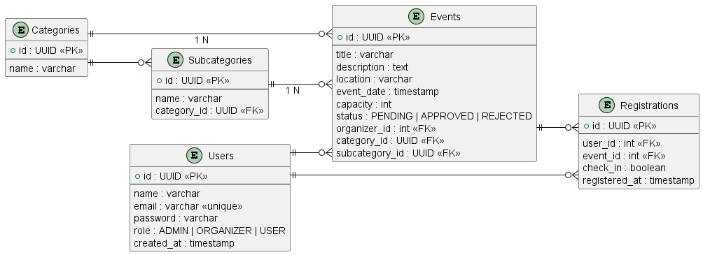

# 📌 Sistema de Gerenciamento de Eventos Acadêmicos

## 📖 Sobre o Projeto

Este projeto consiste no desenvolvimento de um sistema web para gerenciamento de eventos acadêmicos, como palestras, workshops e minicursos.

O objetivo é centralizar o controle de eventos e inscrições em uma única plataforma, facilitando o gerenciamento das informações e a participação dos usuários.

O sistema permitirá cadastro de usuários, criação de eventos e inscrição de participantes.

---

## 🎯 Objetivo

Desenvolver uma aplicação web com frontend e backend separados, utilizando uma API REST para comunicação entre as camadas.

---

## ✅ Funcionalidades

- Cadastro de usuários
- Login e logout
- Cadastro de eventos
- Edição e exclusão de eventos
- Listagem de eventos disponíveis
- Inscrição em eventos
- Visualização de participantes inscritos
- Controle de presença

---

## ⚙️ Requisitos Não Funcionais

- Sistema acessível via navegador
- Interface responsiva
- API seguindo padrão REST
- Senhas armazenadas com criptografia
- Código organizado em camadas
- Tempo de resposta inferior a 2 segundos em operações comuns

---

## 🛠️ Tecnologias Utilizadas

### Backend

- Django
- Django REST Framework

O backend será organizado em **apps separados**, onde cada app representa um domínio do sistema (ex: usuários, eventos, inscrições).  
Essa abordagem melhora a organização, manutenção e escalabilidade do código.

---

### Frontend

- React

Utilizado para construção da interface do usuário e consumo da API.

---

### Estilização

- Tailwind CSS

Framework CSS utilitário para criação de interfaces responsivas de forma rápida.

---

### Banco de Dados

- MySQL

---

### Controle de Versão

- Git
- GitHub

---

## 🏗️ Arquitetura

O sistema segue uma arquitetura **cliente-servidor baseada em API REST**, com frontend e backend separados. A documentação arquitetural utiliza o **modelo C4** para representar o sistema em diferentes níveis de abstração.

Os arquivos de modelagem estão em `./docs/architecture/`:
- `c4-model.puml` - Diagramas C4 em formato PlantUML (edição)

### Nível 1 — Contexto do Sistema



### Nível 2 — Diagrama de Contêineres



### Nível 3 — Componentes do Backend (Django)



### Nível 3 — Componentes do Frontend (React)



---

## 📊 Modelo de Dados

O banco de dados foi modelado seguindo um padrão relacional, com entidades principais para gerenciar usuários, eventos e inscrições:


### Diagrama Entidade-Relacionamento (DER)



O diagrama ER foi atualizado para refletir o novo modelo de dados, incluindo as entidades de categoria e subcategoria associadas diretamente ao evento.

### Entidades Principais

- **Users**: Armazena informações de usuários com diferentes roles (ADMIN, ORGANIZER, USER)
- **Events**: Registro de eventos com informações como título, data, local, capacidade, status de aprovação, categoria e subcategoria
- **Categories**: Representa os cursos ou grandes áreas (ex: Engenharia de Software, Biomedicina)
- **Subcategories**: Representa áreas específicas do curso (ex: Machine Learning, DNA), vinculadas a uma categoria
- **Registrations**: Relacionamento entre usuários e eventos, registrando inscrições e presença

Os arquivos de modelagem estão em `./docs/database/`:
- `erd.puml` - Diagrama em formato PlantUML (edição)
- `erd.png` - Imagem do diagrama

---

## 📋 Organização do Desenvolvimento

O projeto será desenvolvido individualmente, seguindo as etapas:

1. Planejamento e definição de requisitos  
2. Modelagem do banco de dados  
3. Configuração do backend (Django)  
4. Implementação da API REST  
5. Desenvolvimento do frontend em React  
6. Integração frontend ↔ backend  
7. Testes básicos  
8. Documentação  
9. Preparação da apresentação  

---

## 📂 Estrutura do Repositório


```
/projeto-eventos
  /backend
  /frontend
  README.md
```


---

## 🚀 Possíveis Melhorias Futuras

- QR Code para presença
- Certificados em PDF
- Dashboard com estatísticas
- Sistema de permissões (admin/organizador/participante)
- Deploy em nuvem

---

## 👨‍💻 Autor

Igor Thiago Seberino