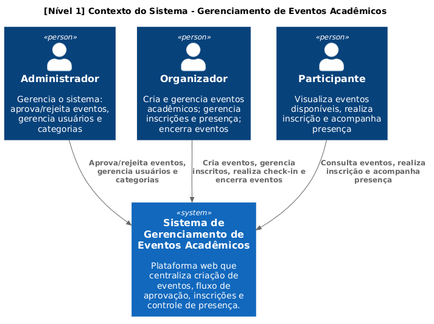
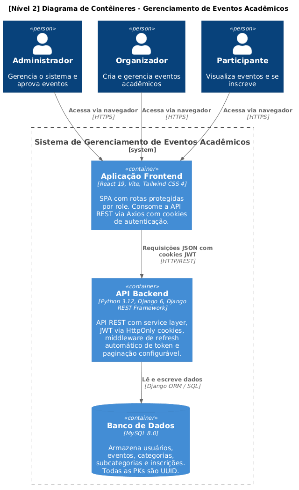
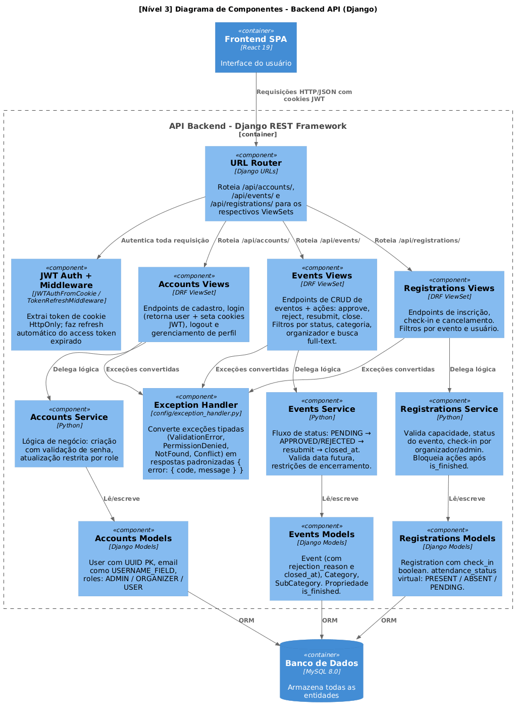
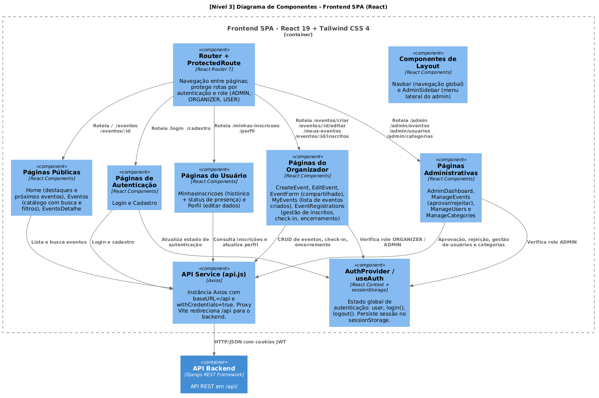
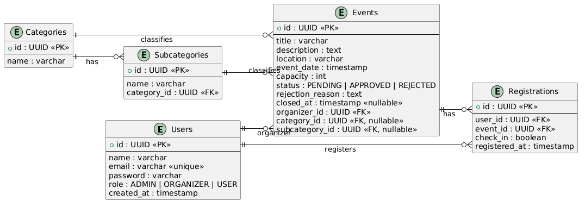

# 📌 Sistema de Gerenciamento de Eventos Acadêmicos

## 📖 Sobre o Projeto

Este projeto consiste no desenvolvimento de um sistema web para gerenciamento de eventos acadêmicos, como palestras, workshops e minicursos.

O objetivo é centralizar o controle de eventos e inscrições em uma única plataforma, facilitando o gerenciamento das informações e a participação dos usuários.

O sistema permitirá cadastro de usuários, criação de eventos e inscrição de participantes.

---

## 🎯 Objetivo

Desenvolver uma aplicação web com frontend e backend separados, utilizando uma API REST para comunicação entre as camadas.

---

## ✅ Funcionalidades

- Cadastro de usuários
- Login e logout
- Cadastro de eventos
- Edição e exclusão de eventos
- Listagem de eventos disponíveis
- Inscrição em eventos
- Visualização de participantes inscritos
- Controle de presença

---

## ⚙️ Requisitos Não Funcionais

- Sistema acessível via navegador
- Interface responsiva
- API seguindo padrão REST
- Senhas armazenadas com criptografia
- Código organizado em camadas
- Tempo de resposta inferior a 2 segundos em operações comuns

---

## 🛠️ Tecnologias Utilizadas

### Backend

**Linguagem e Frameworks:**

- Python — linguagem principal do backend
- Django — framework web principal
- Django REST Framework — construção de APIs RESTful
- django-cors-headers — suporte a CORS para integração frontend-backend

O backend é organizado em **apps separados**, onde cada app representa um domínio do sistema (ex: usuários, eventos, inscrições). Essa abordagem melhora a organização, manutenção e escalabilidade do código.

---

### Frontend

**Linguagem e Frameworks:**

- React — biblioteca principal para construção da interface
- React Router DOM — navegação entre páginas
- Axios — requisições HTTP para a API
- Lucide React — ícones para a interface
- Vite — bundler e ambiente de desenvolvimento
- Tailwind CSS — framework utilitário para estilização rápida e responsiva

O frontend é responsável pela interface do usuário, navegação, consumo da API REST e gerenciamento de requisições HTTP.

---

### Ferramentas de Qualidade/Dev

**Padronização, automação e qualidade de código:**

- Black — formatação automática de código Python
- ESLint — análise estática e padronização de código JavaScript/React
- Prettier — formatação automática de código JavaScript/React
- Husky — hooks de git para automação de tarefas
- lint-staged — executa comandos (linters/formatadores) apenas nos arquivos alterados e staged para commit

---

### Banco de Dados

- MySQL — sistema gerenciador de banco de dados relacional

---

### Controle de Versão

- Git
- GitHub

---

## 🚀 Como Executar

### Com Docker (recomendado)

Pré-requisitos: [Docker Desktop](https://www.docker.com/products/docker-desktop/) instalado e em execução.

```bash
# 1. Criar o arquivo de variáveis a partir do modelo
cp .env.example .env          # Windows PowerShell: Copy-Item .env.example .env

# 2. Construir e subir os containers (db + backend + frontend)
docker compose up --build

# 3. Em outro terminal, popular o banco com dados de exemplo
docker compose exec backend python manage.py populate_db

# 4. (Opcional) Criar um superusuário para o admin do Django
docker compose exec backend python manage.py createsuperuser
```

Acesse:

- **Frontend:** http://localhost:5173
- **API:** http://localhost:8000/api/
- **Admin Django:** http://localhost:8000/admin/

Usuário admin de teste (após `populate_db`): `admin@eventmanager.com` / `Admin@123`.

Para parar: `Ctrl + C` e depois `docker compose down` (use `docker compose down -v` para apagar também os dados do banco).

| Ação | Comando |
| --- | --- |
| Subir em segundo plano | `docker compose up -d` |
| Ver logs ao vivo | `docker compose logs -f` |
| Aplicar migrations | `docker compose exec backend python manage.py migrate` |
| Lint do frontend | `docker compose exec frontend npm run lint` |
| Parar e remover containers | `docker compose down` |

### Sem Docker (manual)

<details>
<summary><strong>Backend</strong> (Python 3.12 + MySQL)</summary>

```bash
cd backend
python -m venv .venv
.venv\Scripts\activate           # Linux/macOS: source .venv/bin/activate
pip install -r requirements.txt
# Configure o .env com um MySQL local (DB_HOST=127.0.0.1)
python manage.py migrate
python manage.py populate_db
python manage.py runserver        # http://localhost:8000
```

</details>

<details>
<summary><strong>Frontend</strong> (Node 20+)</summary>

```bash
cd frontend
npm install
npm run dev                       # http://localhost:5173 (proxy /api -> :8000)
```

</details>

---

## 🏗️ Arquitetura

O sistema segue uma arquitetura **cliente-servidor baseada em API REST**, com frontend e backend separados. A documentação arquitetural utiliza o **modelo C4** para representar o sistema em diferentes níveis de abstração.

Os arquivos de modelagem estão em `./docs/architecture/`:

- `c4-model.puml` - Diagramas C4 em formato PlantUML (edição)

### Nível 1 — Contexto do Sistema



### Nível 2 — Diagrama de Contêineres



### Nível 3 — Componentes do Backend (Django)



### Nível 3 — Componentes do Frontend (React)



---

## 📊 Modelo de Dados

O banco de dados foi modelado seguindo um padrão relacional, com entidades principais para gerenciar usuários, eventos e inscrições:

### Diagrama Entidade-Relacionamento (DER)



O diagrama ER foi atualizado para refletir o novo modelo de dados, incluindo as entidades de categoria e subcategoria associadas diretamente ao evento.

### Entidades Principais

- **Users**: Armazena informações de usuários com diferentes roles (ADMIN, ORGANIZER, USER)
- **Events**: Registro de eventos com informações como título, data, local, capacidade, status de aprovação, categoria e subcategoria
- **Categories**: Representa os cursos ou grandes áreas (ex: Engenharia de Software, Biomedicina)
- **Subcategories**: Representa áreas específicas do curso (ex: Machine Learning, DNA), vinculadas a uma categoria
- **Registrations**: Relacionamento entre usuários e eventos, registrando inscrições e presença

Os arquivos de modelagem estão em `./docs/database/`:

- `erd.puml` - Diagrama em formato PlantUML (edição)
- `erd.png` - Imagem do diagrama

---

## 📋 Organização do Desenvolvimento

O projeto será desenvolvido individualmente, seguindo as etapas:

1. Planejamento e definição de requisitos
2. Modelagem do banco de dados
3. Configuração do backend (Django)
4. Implementação da API REST
5. Desenvolvimento do frontend em React
6. Integração frontend ↔ backend
7. Testes básicos
8. Documentação
9. Preparação da apresentação

---

## 📂 Estrutura do Repositório

```
event-manager-django-react/
├── backend/              # API Django REST Framework
│   ├── accounts/         # Usuários e autenticação (JWT via cookie)
│   ├── events/           # Eventos, categorias e subcategorias
│   ├── registrations/    # Inscrições e check-in
│   ├── scripts/          # Comandos de gestão (ex.: populate_db)
│   ├── config/           # Settings, URLs, auth, middleware, exceções
│   └── Dockerfile
├── frontend/             # SPA React 19 + Vite + Tailwind CSS
│   ├── src/
│   └── Dockerfile
├── docs/                 # Diagramas C4 e modelo ER
├── docker-compose.yml    # Orquestra db (MySQL) + backend + frontend
├── .env.example          # Modelo de variáveis de ambiente
└── README.md
```

---

## 🚀 Possíveis Melhorias Futuras

- QR Code para presença
- Certificados em PDF
- Dashboard com estatísticas
- Sistema de permissões (admin/organizador/participante)
- Deploy em nuvem

---

## 👨‍💻 Autor

Igor Thiago Seberino
